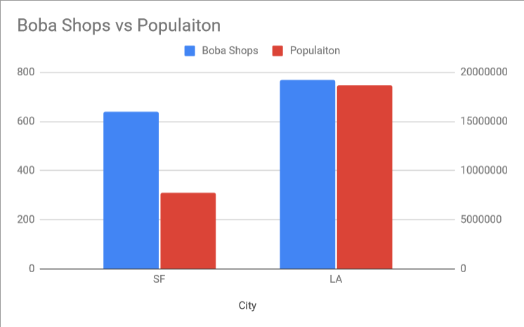
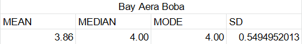

This is a pretty extensive project. Feel free to read the full writeup below, or
        <a href="#findings">skip to the findings</a>. The tableau viz is also
        available [here](https://public.tableau.com/profile/colton4314#!/vizhome/boab_viz/Dashboard1).

## Background

This project was originally inspired by a partial data set I found that had boba shops and their ratings, 
locations, etc pulled from the Yelp API. It got me thinking, what if I could create a data pipeline that 
follows a path like this:

1. A Python script pulls the complete data from the Yelp API 
2. Data is saved as a JSON file to Google Cloud Storage (GCS)
3. A Google Cloud Function (GCF) gets triggered by the upload 
4. Another script that pulls the relevant info from the JSON file and saves it in a CSV file (of course it could be saved as CSV from the start but I wanted to play with GCF more)
5. The CSV file is then loaded to a data warehouse (BigQuery in this case) where duplicates are dealt with and any current records are updated appropriately
6. Tableau pulls the data set down from BigQuery and visualizes findings

## Process

Easily the hardest part is linking everything in the Google Cloud ecosystem. There are so many different services and I am not really familiar with any of them besides BigQuery. To begin, I just did each step manually and decided linking them with GCF will be its own separate part of the project.

### Gathering Data
The first step here was picking cities to include in each region. Originally I was going to use every zipcode in the SF Bay Area census region, but this ran into roadblocks discussed later. I ended up using [this site](http://www.bayareacensus.ca.gov/cities/cities.htm) to get a list of city names, although I didn’t submit a search query for every one. Although it would not really have been any more difficult or costly to include every city, I figured it was basically pointless as the smaller cities often overlapped almost entirely with their larger neighbors (i.e. Daly City and San Francisco). So, I chose the ‘big name’ ones, and also tried to make sure my choices were evenly distributed geographically. I also begrudgingly included cities like Fairfield and Gilroy which I don’t consider part of the Bay Area, because I wanted to try and keep my bias out of the results as much as possible.

<code>
    bay_cities = ['Santa Rosa, CA', 'Novato, CA', 'San Rafael, CA', 'San Francisco, CA', 'San Mateo, CA',
        'Palo Alto, CA', 'San Jose, CA', 'Fremont, CA', 'Hayward, CA', 'Oakland, CA',
        'Richmond, CA', 'Concord, CA', 'Vallejo, CA', 'Napa, CA', 'Pleasanton, CA',
        'Walnut Creek, CA', 'Santa Rosa, CA', 'Fairfield, CA', 'Vacaville, CA', 'Gilroy, CA', 'Antioch, CA']
</code>
<!-- returns: -->
<!-- 
|   |   |   |   |   |
|---|---|---|---|---|
|Alameda|Albany|American Canyon|Antioch|Belmont|
|Benicia|Berkeley|Brentwood|Brisbane|Burlingame|
|Cupertino|Daly City|Danville|Dublin|El Cerrito|
|Emeryville|Fairfield|Foster City|Fremont|Gilroy|
|Hayward|Hercules|Kensington|Lafayette|Livermore|
|Los Altos|Los Gatos|Menlo Park|Millbrae|Milpitas|
|Moraga|Morgan Hill|Mountain View|Napa|Newark|
|Novato|Oakland|Orinda|Pacifica|Palo Alto|
|Petaluma|Pinole|Pittsburg|Pleasant Hill|Pleasanton|
|Redwood City|Richmond|Rohnert Park|San Bruno|San Carlos|
|San Francisco|San Jose|San Leandro|San Lorenzo|San Mateo|	
|San Rafael|San Ramon|Santa Clara|Santa Rosa|Saratoga|
|Sonoma|South San Francisco|Suisun City|Sunnyvale|Union City|
|Vacaville|Vallejo|Walnut Creek|West Menlo Park|| -->

‘SoCal’ area cities were a little trickier. Not being a native of SoCal it was hard to discern where SoCal or LA started and where they ended. I knew that San Diego and LA shouldn't be considered together, but what about Orange County? Unfortunately, there’s not really a clear census region like there is in the Bay Area. I ended up going with “Greater Los Angeles” and using the Los Angeles-Long Beach-Santa Ana-Riverside area. Basically from Thousand Oaks to Irvine, and Long Beach to San Bernardino. Google Maps came in handy to see which areas seemed geographically separate.

<code>
la_cities = ['Los Angeles, CA', 'Long Beach, CA', 'Irvine, CA', 'Santa Ana, CA', 'Anaheim, CA', 'Santa Monica, CA',
        'Burbank, CA', 'Malibu, CA', 'Thousand Oaks, CA', 'Santa Clarita, CA', 'Ontaria, CA', 'West Covina, CA',
        'Riverside, CA', 'San Bernardino, CA', 'Pasadena, CA', 'Huntington Beach, CA']
</code>

<!-- returns (sorry, not alphabetized):

|   |   |   |   |   |
|---|---|---|---|---|
|Mira Loma|Anaheim|Rowland Heights|West Hollywood|Tustin|
|Los Angeles|Gardena|La Verne|Santa Clarita|Wilmington|
|Glendale|Brea|Ontario|Running Springs|San Dimas|
|Riverside|Fullerton|Montclair|Pasadena|Signal Hill|
|Hacienda Heights|South Gate|Seal Beach|Huntington Beach|Simi Valley|
|Diamond Bar|Long Beach|Pomona|Whittier|Monrovia|
|Temple City|Irvine|Culver City|Laguna Hills|Upland|
|Buena Park|Thousand Oaks|Carson|La Habra|Montrose|
|Cypress|San Bernardino|Rosemead|Montebello|South Pasadena|
|Westminster|Van Nuys|Downey|Norwalk|Tujunga|
|Mission Viejo|La Mirada|Torrance|Santa Monica|Colton|
|Santa Ana|Pico Rivera|Walnut|Azusa|Redondo Beach|
|Baldwin Park|Fountain Valley|West Covina|Stanton|Winnetka|
|Claremont|Irwindale|Lynwood|Chino|Highland|
|Cerritos|Chino Hills|Alhambra|Covina|Loma Linda|
|South El Monte|Artesia|Garden Grove|La Crescenta|Foothill Ranch|
|Redlands|-|-|-|-| -->

The script was pretty simple, I considered using Ruby but went with Python because it really feels unmatched in simplicity and elegance for these types of projects. The hard part here was figuring out the Yelp API. On paper, it’s a simple API; you send a get request to the API with the parameters you want to search by (location, category, term, etc) and their values, and a header with your API key.

However, I quickly hit a major tripping point: there’s a serious lack of granularity. The API and indeed Yelp itself doesn’t really provide a way to restrict or filter results on location (zip, city, geofence, etc). Well it does, but it will still return results outside of the boundary, mixed with results inside. This of course made it difficult to perform my original search which was going to be by zipcode. In the end, using the major cities in each region lead to major overlap (touched on earlier). For example, for the Bay Area search there were 2030 raw results but only 658 unique entries. Nothing a bit of SQL (or even Excel in this case) can’t fix but I would have prefered cleaner raw data.

### Cleaning
This time around I manually cleaned the data using Excel, but ideally in the future this will be a part of the pipeline. I took out restaurants that had category “foodtrucks” and any Panda Express entries. Not sure why Yelp assigns Panda Express the Bubble Tea category, but I don’t consider it a boba shop. A major caveat of this data is that it's difficult to define “boba shop”. Many places don't have “boba” in their names, and many also have multiple food related category tags. Because of this, there are undoubtedly a handful of entries that are simply restaurants that happen to serve milk tea, but I believe there are very few of these and therefore they don’t affect the data.

### On The Cloud
I uploaded the cleaned file to GCS into respective buckets processed Bay Area data and processed LA data). In BigQuery I created a dataset and uploaded both files as tables. This is likely easy enough to do with a GCF (triggered by upload of a new file to GCS), but I’d prefer to do all connections together. From there I simply connected the BigQuery dataset to Tableau and started visualizing.

<h2><a id="findings">Findings</a></h2>
Of course the most important finding was that the LA area has a higher average rating than the Bay Area. Debate abounds as to whether this means they have better quality boba or they are just more generous with ratings or have a low bar. Beyond the differences in averages, there were some unexpected other findings. 

First, the difference in the number of locations. LA has only 770 locations VS 638 in the Bay Area. That's only a 17% difference, despite there being almost 2.5 times as many people living in the LA area (7.75m vs 18.71m). It seems people in the Bay Area like boba much more than LA and are thus able to support a far greater number of locations on a per capita basis.

Second, the chain Quickly was consistently rated very poorly.
Using:

<code>
SELECT 
    &nbsp;name, 
    &nbsp;rating, 
    &nbsp;ROUND(AVG(rating) OVER (PARTITION BY name), 2) AS chain_avg 
FROM ( 
    &nbsp;SELECT 
        &nbsp;&nbsp;id, 
        &nbsp;&nbsp;LEFT(name, 7) AS name, 
        &nbsp;&nbsp;rating 
    &nbsp;FROM 
        &nbsp;&nbsp;bay_area_boba 
    &nbsp;WHERE 
        &nbsp;&nbsp;name LIKE '%Quickly%') sub
</code>

We get Bay Area Results showing the average rating of the chain is 2.98 over 32 locations.
Additionally, there are several locations with a sub 3 star rating with the min being 1.5 stars, which is pretty bad.

LA fairs better but is still well below the average: the chain scores 3.38 stars over 8 locations, this time
with a min of 2.5.

This is a somewhat surprising finding as not only is Quickly a fairly widespread chain, but they were one of the early pioneers of the boba shop in California. Between their experience and enough popularity to maintain dozens of locations, I would have expected better. Indeed, in the Bay Area the Quickly rating is actually 2 SD from the mean in The Bay, which is a significantly poor performance.

Finally, I was surprised to see the difference in ratings. Over all the locations pulled, locations in San Francisco had a
total of 35,256 ratings. San Jose, the most populous city in the region had 30,717. Compare this to LA with only 23,113 followed
by Irvine with 16,175. Like before this is pretty surprising gven the difference in populaiton. Even with fewer shops per capita I would have expected LA to have had more ratings than SF simply because their populaitons dwarfs ours.

## Conclusion

The findings seem to indicate that there is a difference in 'boba culture' between the Bay Area
and Souther California. I didnt compare this to granular demographic data, but my main hypothesis for
this divergence is there is a larger population of fresh immigrants from Asia in the Bay Area. Since boba
is so big in places like Hong Kong and Taiwan, the high concentration of immigrants from these locatiions
is likely a two fold benefit. Immigrants coming from boba rich areas have higher consumption and therefore are
able to sustain more demand and more shops, and at the same time they are bringing new innovations, flavors,
and supply chain connections from their home country which in turn leads to a fresher and more vibrant
boba scene.

Overall this was an enjoyable project. Ideally I will be able to automate basically all of it using GCF, so
I will be sure to update this when that happens. Additionally, I will be implementing a live tracker on this
site that compares rating averages between the two regions... at some point... Keep an eye out for that.
